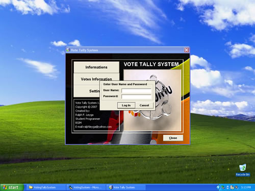



## COMPUTERIZED VOTING TALLY SYSTEM USING VB6 WITH ADODC/ADOBB/ADO

### Description

This system will help you to use a listview as a grid in vb6.0 it uses a ms access were the data to store... It is easiest way to learn a adodb and adodc or a ado....... using a hard code for you.
 
### More Info
 

             |
---                |---
**Submitted On**   |2008-09-02 15:01:38
**By**             |[ralph f\. leyga](https://github.com/Planet-Source-Code/PSCIndex/blob/master/ByAuthor/ralph-f-leyga.md)
**Level**          |Intermediate
**User Rating**    |4.0 (8 globes from 2 users)
**Compatibility**  |VB 3\.0, VB 4\.0 \(16\-bit\), VB 4\.0 \(32\-bit\), VB 5\.0, VB 6\.0
**Category**       |[Databases/ Data Access/ DAO/ ADO](https://github.com/Planet-Source-Code/PSCIndex/blob/master/ByCategory/databases-data-access-dao-ado__1-6.md)
**World**          |[Visual Basic](https://github.com/Planet-Source-Code/PSCIndex/blob/master/ByWorld/visual-basic.md)
**Archive File**   |[COMPUTERIZ212570932008\.zip](https://github.com/Planet-Source-Code/ralph-f-leyga-computerized-voting-tally-system-using-vb6-with-adodc-adobb-ado__1-71045/archive/master.zip)

### API Declarations

This system will help you to use a listview as a grid in vb6.0 it uses a ms access were the data to store... It is easiest way to learn a adodb and adodc or a ado....... using a hard code for you.

